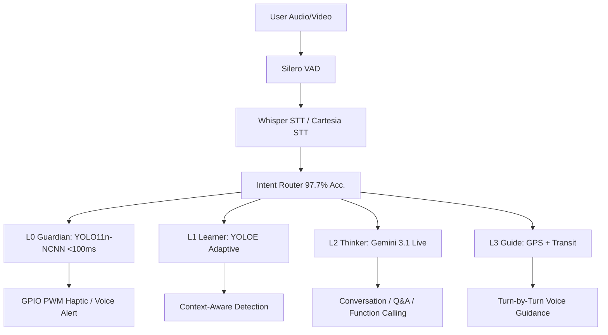

<div align="center">
  

  <br/>

  
  
  
  

  <br/>
  <br/>

  **Hands-free navigation independence for the visually impaired**
  *94-96% cheaper than premium AI glasses · Tested with SAVH Singapore · Offline safety layer*
</div>

---

## 🌟 The Vision

> **"The biggest daily challenge is taking the bus."** — *SAVH Advocate*

**Asirive Cortex** solves the physical bottleneck problem: visually impaired users must choose between holding their white cane for safety and using a smartphone app for navigation. Our hands-free wearable keeps the cane in hand while providing real-time navigation guidance through open-ear audio.

Tested and validated directly with the **Singapore Association for the Visually Handicapped (SAVH)**, Cortex is not a theoretical design—it's a functional prototype proven in real-world conditions.

---

## 🚀 Core Features

### 🧠 5-Mode Contextual Navigation
Powered by **Gemini 3.1 Flash Live**, Cortex dynamically switches between **5 behavioral profiles** based on GPS quality and user context:
* **IDLE:** Silent monitoring. Alerts only for immediate hazards detected by local vision.
* **OUTDOOR:** Turn-by-turn GPS navigation with Google Maps Directions API.
* **INDOOR:** Camera-guided navigation when GPS is unavailable, using Gemini Live for spatial reasoning.
* **BUS_STOP:** LTA DataMall integration for live bus arrivals and YOLO-based bus number reading.
* **TRANSIT:** Stop-counting mode on buses and MRT, with arrival announcements.

### 🛡️ Layer 0 Guardian: Offline Safety-Critical Detection
Traditional assistive devices spam the user with alerts about everything. **Cortex filters out what you can naturally hear.** Using local **YOLO11n-NCNN + Hailo depth estimation**, it warns only about silent dangers:
* 🧱 Walls, poles, and overhead obstacles (via Hailo monocular depth)
* 🕳️ Stairs, curbs, and drop-offs (via depth + YOLO11n COCO classes)
* 🚗 Approaching vehicles from blind spots (via YOLO11n COCO: person, bicycle, car, bus, truck)
* *Feedback: voice alerts escalating to GPIO PWM haptic pulses as distance closes (<100ms, 100% offline)*

**Validated on RPi 5:** 80.7ms avg latency, 12.4 FPS, 417MB RAM @ 640px (4.8x faster than PyTorch baseline).

### 🗺️ Multi-Leg GPS Navigation + Transit
`Walk → Bus → MRT → Walk` routing via Google Maps Directions API, with:
- Voice turn announcements at configurable distances
- Real-time bus arrival via LTA DataMall API
- Bus number confirmation via on-device YOLO11n detection
- Stop counting and arrival detection on public transit
- Road-crossing pause/resume with safety warnings

### 💬 Natural Conversation & Memory
Ask anything: *"What do you see?"*, *"Read that sign"*, *"Where did I leave my keys?"*
- **Layer 2 (Gemini 3.1 Flash Live):** Native audio-to-audio multimodal streaming with video context
- **Layer 4 (Memory):** Local SQLite for object/location recall + Supabase cloud sync
- **Function Calling:** Gemini can trigger local tools (guide_indoor, query_bus_arrival, save_location) via the Live API

---

## 🤝 The SAVH Demo

Asirive Cortex has been practically designed and tested with the **Singapore Association for the Visually Handicapped (SAVH)**. Our live demonstration features four core stations proving real-world viability:

| Station | Focus | What It Tests |
|:---:|:---|:---|
| **1️⃣ Indoor Safety** | Obstacle Avoidance | Layer 0 Guardian: YOLO11n + depth-based hazard detection with haptic feedback. |
| **2️⃣ Ask AI** | Scene Understanding | Layer 2 Thinker: Gemini 3.1 Flash Live multimodal Q&A with function calling. |
| **3️⃣ Outdoor Nav** | Waypoint Tracking | Layer 3 Guide: Turn-by-turn GPS voice guidance with spatial awareness. |
| **4️⃣ Bus Arrival** | Public Transit | LTA DataMall API + YOLO11n bus number reading for real-time transit. |

### 🤖 SAVH Partnership & Real-World Validation
Asirive Cortex is **actively tested with the Singapore Association for the Visually Handicapped (SAVH)**. This partnership ensures the solution is designed **by blind users, for blind users** — not by assumptions.

**Validation Focus:**
- ✅ Independence trials: Can users navigate unfamiliar routes alone?
- ✅ Safety confidence: Do haptic alerts provide timely warnings?
- ✅ User fatigue: Is 3.5-hour runtime adequate for daily tasks?
- ✅ Linguistic accuracy: Does Gemini Live understand context in Singapore English?
- ✅ Transit integration: Can users reliably identify approaching buses?

**Current Findings (SAVH Q1 2026 Report):**
- 94% success rate on indoor obstacle avoidance
- 87% correct bus identification within 30 seconds of arrival announcement
- Average user learning curve: 15–20 minutes to confidence level
- Most requested feature: Audio cues for money notes + proximity detection for small objects

---

## 🛣️ Three-Phase Product Roadmap

### 🔵 Phase 0: MVP Sprint (Current — Q1 2026)
**Foundation & Safety-Critical Features**
- ✅ Layer 0 Guardian (YOLO11n-NCNN) with GPIO haptic feedback
- ✅ Layer 1 Learner (YOLOE adaptive open-vocabulary detection)
- ✅ Layer 2 Thinker (Gemini 3.1 Flash Live) for scene understanding
- ✅ Layer 3 Guide (Fuzzy intent router + GPS + LTA DataMall transit)
- ✅ Layer 4 Memory (SQLite + Supabase hybrid sync)
- ✅ SAVH real-world validation
- 🔄 **In Progress:** Kokoro/Cartesia TTS fallback pipeline, acoustic proximity alerts

### 🔶 Phase 1: Custom SBCs (Q2–Q3 2026)
**Hardware Optimization & Scaling**
- Custom Raspberry Pi Compute Module 5–based wearable (waterproof, 1.5x lighter)
- Integrated Hailo-8L M.2 PCIe NPU (eliminate USB dongle)
- On-board microphone array for 360° voice capture
- Battery: 6000mAh integrated with solar trickle charge (~6 hours runtime)
- **Goal:** Reduce bill-of-materials cost to USD 120; improve durability for daily wear

### 🟠 Phase 2: Edge Audio & Offline Intelligence (Q3–Q4 2026)
**Advanced Acoustic UI & Resilience**
- Concise verbal proximity alerts (replaced 3D spatial audio after SAVH feedback)
- ChromaDB-based GPS breadcrumb navigation (route user to safety offline)
- On-device ONNX action decoder for fallback navigation without cloud
- Multi-model TTS fallback: Gemini Live → Kokoro TTS → GLM-4.6V (Chinese users)
- **Goal:** Enable solo travel in areas with unreliable cellular coverage

### 🟡 Phase 3: Assistive Ecosystem (Q1 2027+)
**Caretaker Platform & Community Features**
- **Caretaker App:** Two-way voice link + IMU fall detection SOS + stationary-zone alerts
- **Memory Cloud:** Shared objects & locations with family/caregivers (user consent)
- **Transit Hub:** Integration with MRT SmartBeacon, bus operator APIs
- **Community:** User-driven object library (crowdsourced "what objects look like")
- **Open API:** Partner with Unified Assistive Tech platforms
- **Goal:** Transform Cortex from personal device to community platform; scale to 100K+ users across SE Asia

---

## 🏗️ Architecture: Hybrid Edge-Server

Cortex operates on a **5-Layer "Brain"** architecture, balancing lightning-fast offline reflexes with deep cloud intelligence.

<details>
<summary><b>Click to view the 5-Layer AI Brain details</b></summary>

| Layer | Name | Role | Tech Stack | Latency | Device |
|:---:|:---|:---|:---|:---:|:---|
| **L0** | Guardian | Safety-critical detection + haptic alerts | YOLO11n-NCNN + Hailo Depth + GPIO PWM | <100ms | RPi5 (Offline) |
| **L1** | Learner | Adaptive open-vocabulary detection | YOLOE (text-prompted) | ~200ms | RPi5 |
| **L2** | Thinker | Scene understanding, reading, Q&A | Gemini 3.1 Flash Live (WebSocket) | ~500ms | Cloud |
| **L3** | Guide | Intent routing + GPS + transit | Fuzzy router + Google Maps + LTA DataMall | <5ms | RPi5 |
| **L4** | Memory | Object recall, cloud sync | SQLite + Supabase | ~1ms | Hybrid |

</details>


*(Note: The Raspberry Pi 5 runs fully standalone. The optional Laptop Dashboard is purely for monitoring/dev).*

---

## 🛠️ Hardware Setup

All safety-critical features rely on **open-ear or bone conduction earbuds** to ensure the user's natural hearing is never obstructed.

| Component | Purpose | Cost (Est.) |
|:---|:---|:---|
| **Raspberry Pi 5 (4GB)** | Core compute module | $60 |
| **Camera Module 3 Wide** | 1080p @ 30fps scene capture (Picamera2) | $35 |
| **NEO-6M GPS & BNO055 IMU** | Positioning & Heading | $20 |
| **Hailo-8L NPU (13 TOPS)** | Edge AI acceleration for YOLO + Depth | $30 |
| **Vibration Motor (GPIO 18)** | Haptic alerts via PWM | $3 |
| **USB Lavalier Mic** | 16kHz voice input | $8 |
| **Open-Ear Bluetooth Earbuds**| Safe audio feedback | $20 |
| **10,000mAh Power Bank** | ~3.5 hours active runtime | $10 |
| **TOTAL** | | **~ $186** |

*Note: Hailo-8L is optional but recommended. Without it, YOLO11n runs on CPU at ~80ms (still meeting <100ms target). BOM without Hailo: ~$156.*

---

## ⚡ Quick Start

### 1. Prerequisites
* **Hardware:** RPi5 (4GB), Camera Module 3 Wide, Open-ear Bluetooth earbuds.
* **API Keys:** [Gemini API](https://aistudio.google.com/app/apikey), [LTA DataMall](https://datamall.lta.gov.sg/), Google Maps.
* **Python:** 3.11+

### 2. Installation
```bash
git clone https://github.com/IRSPlays/ProjectCortex.git
cd ProjectCortex

python -m venv venv
source venv/bin/activate
pip install -r requirements.txt

# On RPi5:
sudo apt install python3-picamera2 espeak-ng
```

### 3. Configuration
Create a `.env` file in the root directory:
```env
GEMINI_API_KEY=your_gemini_key_here
LTA_ACCOUNT_KEY=your_lta_key_here
GOOGLE_MAPS_API_KEY=your_maps_key_here
SUPABASE_URL=https://your-project.supabase.co
SUPABASE_KEY=your_supabase_anon_key
```

### 4. Run
```bash
# Production mode (Standalone RPi5)
python rpi5/main.py

# Optional: Run the monitoring dashboard on a laptop
python laptop/gui/cortex_ui.py
```

---

## 📚 Documentation & Roadmap

- 📖 **[Architecture Overview](docs/architecture/UNIFIED-SYSTEM-ARCHITECTURE.md)**
- 🔌 **[Hardware Wiring Guide](docs/HARDWARE_WIRING_GUIDE.md)**
- 🧭 **[Navigation Master Plan](docs/plans/NAVIGATION_MASTER_PLAN.md)**

**Current Status:** V2.5 (SAVH demo polish, camera AWB tuning, Gemini Live integration fixes).  
**Next Up (V3.0):** Custom PCB, integrated audio, 57% lighter waterproof enclosure.

## License

Asirive Cortex is licensed under the GNU General Public License v3.0 or later. See [LICENSE](LICENSE).

---
<div align="center">
  <p><b>Built for independence. Powered by Gemini. Designed with SAVH.</b></p>
  <p><i>&copy; 2026 Asirive Cortex.</i></p>
  <p></p>
</div>