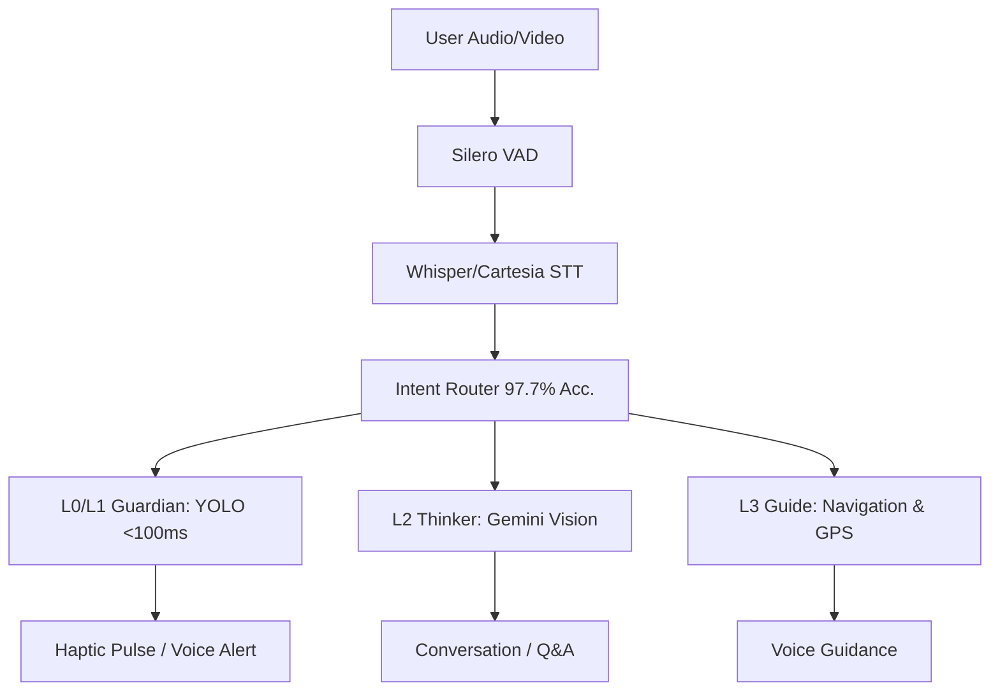

<div align="center">
  

  <br/>

  
  
  
  

  <br/>
  <br/>
  
  **Context-aware AI companion · Silent-danger-first safety · GPS navigation with transit · Natural conversation**
  
  *Turn on → it works. Say where → it navigates. Say nothing → it keeps you safe.*
</div>

---

## 🌟 The Vision

> **"The biggest daily challenge is taking the bus."** — *SAVH Advocate*

1.3 billion people live with vision impairment. Existing AI glasses describe scenes — but they don't **navigate**. They can't guide a blind person to a bus stop, tell them which bus is arriving, or help them board the right one. 
**ProjectCortex** solves this by providing true independent mobility through a highly advanced, <$150 chest-mounted wearable.

---

## 🚀 Core Features

### 🧠 6-Mode Contextual AI
Powered by **Gemini 3.1 Flash Live**, Cortex doesn't just have one personality. It dynamically switches between **6 behavioral profiles** based on context:
* **IDLE:** Silent and observant. Only speaks for overhead hazards.
* **OUTDOOR_NAV:** Turn-by-turn GPS companion.
* **INDOOR_NAV:** Proactive camera guidance when GPS is lost.
* **BUS_WATCH:** Laser-focused on reading bus numbers and LTA DataMall arrivals.
* **TRANSIT:** Quietly announces stops and remaining journey time.
* **EXPLORE:** Detailed scene narration on demand.

### 🛡️ Silent-Dangers-Only Safety System
Traditional assistive devices spam the user with alerts about everything (people, dogs, cars). **ProjectCortex filters out what you can naturally hear.** 
Using local **YOLO + Depth sensing**, it warns **ONLY** about silent dangers:
* 🧱 Walls, poles, and overhead obstacles
* 🕳️ Stairs, curbs, and drop-offs
* 🚗 Approaching vehicles from blind spots
* *Feedback escalates from voice alerts to haptic pulses as distance closes. (<100ms latency, 100% Offline)*

### 🗺️ GPS Navigation + Transit
Multi-leg routing made easy: `Walk → Bus → MRT → Walk`. Features voice navigation, real-time stop counting, and precise arrival detection.

### 💬 Natural Conversation & Memory
Ask anything: *"What do you see?"*, *"Read that sign"*, *"Where did I leave my keys?"*. Built-in local SQLite and Supabase cloud sync allows Cortex to remember objects and locations for you.

---

## 🤝 The SAVH Demo

ProjectCortex has been practically designed and tested with the **Singapore Association for the Visually Handicapped (SAVH)**. Our live demonstration features four core stations proving real-world viability:

| Station | Focus | What It Tests |
|:---:|:---|:---|
| **1️⃣ Indoor Safety** | Obstacle Avoidance | Tiered safety protocols: voice alerts escalating to haptic pulses for silent indoor hazards. |
| **2️⃣ Ask AI** | Scene Understanding | Real-time multimodal Q&A with Gemini Live and function calling. |
| **3️⃣ Outdoor Nav** | Waypoint Tracking | Turn-by-turn voice guidance and spatial awareness outdoors. |
| **4️⃣ Bus Arrival** | Public Transit | LTA DataMall integration combined with live YOLO bus detection to identify arriving buses. |

---

## 🏗️ Architecture: Hybrid Edge-Server

Cortex operates on a **5-Layer "Brain"** architecture, balancing lightning-fast offline reflexes with deep cloud intelligence.

<details>
<summary><b>Click to view the 5-Layer AI Brain details</b></summary>

| Layer | Name | Role | Tech Stack | Latency | Device |
|:---:|:---|:---|:---|:---:|:---|
| **L0** | Guardian | Safety-critical detection + haptic alerts | YOLO v11 NCNN + GPIO | <100ms | RPi5 (Offline) |
| **L1** | Learner | Adaptive open-vocabulary detection | YOLOE | ~200ms | RPi5 |
| **L2** | Thinker | Scene understanding, reading, Q&A | Gemini 3.1 Flash Live | ~500ms | Cloud |
| **L3** | Guide | Intent routing + GPS + transit | Fuzzy router + LTA DataMall| <5ms | RPi5 |
| **L4** | Memory | Object recall, cloud sync | SQLite + Supabase | ~1ms | Hybrid |

</details>


*(Note: The Raspberry Pi 5 runs fully standalone. The optional Laptop Dashboard is purely for monitoring/dev).*

---

## 🛠️ Hardware Setup

All safety-critical features rely on **open-ear or bone conduction earbuds** to ensure the user's natural hearing is never obstructed.

| Component | Purpose | Cost (Est.) |
|:---|:---|:---|
| **Raspberry Pi 5 (4GB)** | Core compute module | $60 |
| **Camera Module 3 Wide** | 1080p @ 30fps scene capture | $35 |
| **NEO-6M GPS & BNO055 IMU** | Positioning & Heading | $20 |
| **Vibration Motor & Button** | Haptic alerts & input control | $3 |
| **USB Lavalier Mic** | 16kHz voice input | $8 |
| **Open-Ear Bluetooth Earbuds**| Safe audio feedback | $20 |
| **5000mAh Power Bank** | ~4 hours active runtime | $10 |
| **TOTAL** | | **~ $156** |

---

## ⚡ Quick Start

### 1. Prerequisites
* **Hardware:** RPi5 (4GB), Camera Module 3 Wide, Open-ear Bluetooth earbuds.
* **API Keys:** [Gemini API](https://aistudio.google.com/app/apikey), [LTA DataMall](https://datamall.lta.gov.sg/), Google Maps.
* **Python:** 3.11+

### 2. Installation
```bash
git clone https://github.com/IRSPlays/ProjectCortex.git
cd ProjectCortex

python -m venv venv
source venv/bin/activate
pip install -r requirements.txt

# On RPi5:
sudo apt install python3-picamera2 espeak-ng
```

### 3. Configuration
Create a `.env` file in the root directory:
```env
GEMINI_API_KEY=your_gemini_key_here
LTA_ACCOUNT_KEY=your_lta_key_here
GOOGLE_MAPS_API_KEY=your_maps_key_here
SUPABASE_URL=https://your-project.supabase.co
SUPABASE_KEY=your_supabase_anon_key
```

### 4. Run
```bash
# Production mode (Standalone RPi5)
python rpi5/main.py

# Optional: Run the monitoring dashboard on a laptop
python laptop/gui/cortex_ui.py
```

---

## 📚 Documentation & Roadmap

- 📖 **[Architecture Overview](docs/architecture/UNIFIED-SYSTEM-ARCHITECTURE.md)**
- 🔌 **[Hardware Wiring Guide](docs/HARDWARE_WIRING_GUIDE.md)**
- 🧭 **[Navigation Master Plan](docs/plans/NAVIGATION_MASTER_PLAN.md)**

**Current Status:** V2.5 (SAVH demo polish, hazard cooldown fixes). 
**Next Up (V3.0):** Custom PCB, integrated audio, 57% lighter waterproof enclosure.

---
<div align="center">
  <p><b>Built for independence. Powered by Gemini. Designed with SAVH.</b></p>
  <p><i>ProjectCortex by <a href="https://github.com/IRSPlays">Haziq</a></i></p>
  <p></p>
</div>