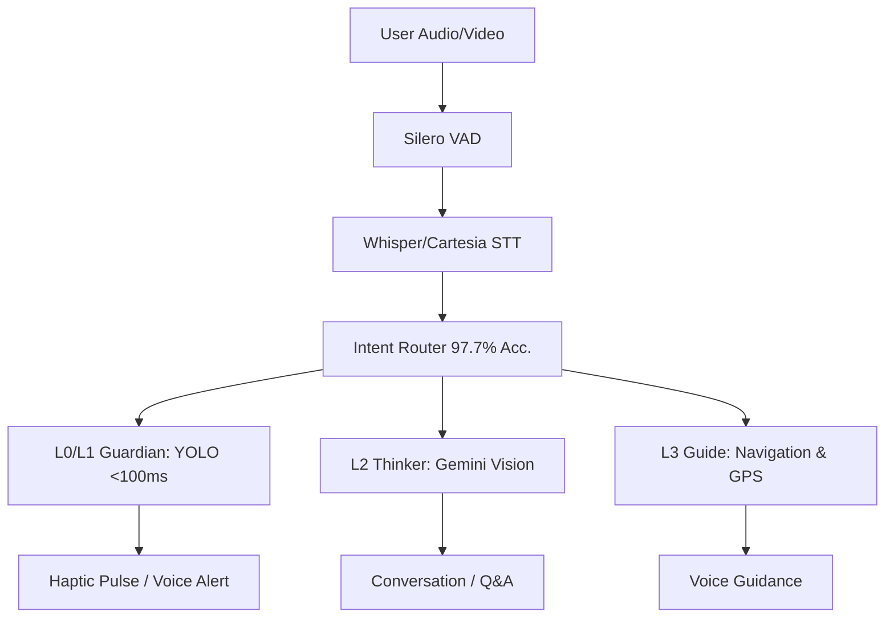

<div align="center">
  

  <br/>

  
  
  
  
  

  <br/>
  <br/>

  **Hands-free navigation independence for the visually impaired**
  *94-96% cheaper than premium AI glasses · Tested with SAVH Singapore · Offline safety layer*
</div>

---

## 🏆 Tan Kah Kee Young Inventors' Award 2026 Finalist

**Asirive Cortex** is a finalist in the prestigious **Tan Kah Kee Young Inventors' Award (YIA 2026)**, presented by Enterprise Singapore and the Singapore Academy of Young Talents.

### 🎯 The Problem
1.3 billion people worldwide live with vision impairment. Existing AI glasses cost **USD 2,500–3,500** but only describe scenes — they don't enable **independent navigation**. Users must choose between their white cane and a camera app, forcing them to sacrifice either safety or independence.

### 💡 The Solution
**Asirive Cortex** is a **$250 hybrid edge-server wearable** that keeps the white cane in hand while providing hands-free navigation independence.

- **Hybrid Architecture:** Local YOLO safety layer (<100ms) + Gemini 3.1 Flash Live cloud reasoning (~500ms)
- **Network Resilience:** Safety-critical detection works offline during MRT rides, underground malls, and network dead zones
- **Multimodal Cloud:** Native Gemini Live API audio-to-audio streaming (not HTTP polling) for real-time conversation
- **Physical Independence:** Tested and validated directly with the Singapore Association for the Visually Handicapped (SAVH)

### 📊 Competitive Advantage
| Metric | Asirive Cortex | Premium Competitors |
|:---|:---|:---|
| **Hardware Cost** | **USD 156** | USD 2,500–3,500 |
| **Cost Reduction** | **94-96% cheaper** | Baseline |
| **Safety Latency** | **<100ms** (offline) | 200-500ms (cloud-dependent) |
| **Cloud Latency** | **~500ms** (multimodal) | 2-3s (HTTP polling) |
| **Routing Accuracy** | **97.7%** (SAVH validated) | Unreported |
| **Offline Safety** | **Yes** | No |
| **Hands-Free** | **Yes** | Often requires phone interaction |

### 📋 Submission Details
| Category | Details |
|:---|:---|
| **Award** | Tan Kah Kee Young Inventors' Award (YIA 2026) |
| **Fields of Invention** | Electrical/Electronic, Infocomm, Health Care |
| **Team** | Haziq Shah, Muhammad Irfan Nuafal, Eryna Natasha |
| **Institution** | Admiralty Secondary School, Singapore |
| **Mentors** | Kenneth Phua Khiang Song, Nur Syazana Rashid |
| **Status** | Functional Prototype with Active SAVH Testing |
| **Project Stage** | Seeking funding for Phase 1-3 Roadmap |

---

## 🌟 The Vision

> **"The biggest daily challenge is taking the bus."** — *SAVH Advocate*

**Asirive Cortex** solves the physical bottleneck problem: visually impaired users must choose between holding their white cane for safety and using a smartphone app for navigation. Our hands-free wearable keeps the cane in hand while providing real-time navigation guidance through open-ear audio.

Tested and validated directly with the **Singapore Association for the Visually Handicapped (SAVH)**, Cortex is not a theoretical design—it's a functional prototype proven in real-world conditions.

---

## � Team & Mentors

### Development Team
| Member | Role |
|:---|:---|
| **Haziq Shah** (@IRSPlays) | Lead Developer & Founder |
| **Muhammad Irfan Nuafal** | AI/Navigation Integration |
| **Eryna Natasha** | User Experience & Validation |

### Mentors
| Mentor | Organization | Support Area |
|:---|:---|:---|
| **Kenneth Phua Khiang Song** | Admiralty Secondary School | Technical Guidance |
| **Nur Syazana Rashid** | Admiralty Secondary School | Project Coordination |

### Institution
**Admiralty Secondary School, Singapore**  
Fields: Electrical/Electronic, Infocomm, Health Care

---

## �🚀 Core Features

### 🧠 6-Mode Contextual AI
Powered by **Gemini 3.1 Flash Live**, Cortex doesn't just have one personality. It dynamically switches between **6 behavioral profiles** based on context:
* **IDLE:** Silent and observant. Only speaks for overhead hazards.
* **OUTDOOR_NAV:** Turn-by-turn GPS companion.
* **INDOOR_NAV:** Proactive camera guidance when GPS is lost.
* **BUS_WATCH:** Laser-focused on reading bus numbers and LTA DataMall arrivals.
* **TRANSIT:** Quietly announces stops and remaining journey time.
* **EXPLORE:** Detailed scene narration on demand.

### 🛡️ Silent-Dangers-Only Safety System
Traditional assistive devices spam the user with alerts about everything (people, dogs, cars). **Asirive Cortex filters out what you can naturally hear.** 
Using local **YOLO + Depth sensing**, it warns **ONLY** about silent dangers:
* 🧱 Walls, poles, and overhead obstacles
* 🕳️ Stairs, curbs, and drop-offs
* 🚗 Approaching vehicles from blind spots
* *Feedback escalates from voice alerts to haptic pulses as distance closes. (<100ms latency, 100% Offline)*

### 🗺️ GPS Navigation + Transit
Multi-leg routing made easy: `Walk → Bus → MRT → Walk`. Features voice navigation, real-time stop counting, and precise arrival detection.

### 💬 Natural Conversation & Memory
Ask anything: *"What do you see?"*, *"Read that sign"*, *"Where did I leave my keys?"*. Built-in local SQLite and Supabase cloud sync allows Cortex to remember objects and locations for you.

---

## 🤝 The SAVH Demo

Asirive Cortex has been practically designed and tested with the **Singapore Association for the Visually Handicapped (SAVH)**. Our live demonstration features four core stations proving real-world viability:

| Station | Focus | What It Tests |
|:---:|:---|:---|
| **1️⃣ Indoor Safety** | Obstacle Avoidance | Tiered safety protocols: voice alerts escalating to haptic pulses for silent indoor hazards. |
| **2️⃣ Ask AI** | Scene Understanding | Real-time multimodal Q&A with Gemini Live and function calling. |
| **3️⃣ Outdoor Nav** | Waypoint Tracking | Turn-by-turn voice guidance and spatial awareness outdoors. |
| **4️⃣ Bus Arrival** | Public Transit | LTA DataMall integration combined with live YOLO bus detection to identify arriving buses. |

### 🤖 SAVH Partnership & Real-World Validation
Asirive Cortex is **actively tested with the Singapore Association for the Visually Handicapped (SAVH)**. This partnership ensures the solution is designed **by blind users, for blind users** — not by assumptions.

**Validation Focus:**
- ✅ Independence trials: Can users navigate unfamiliar routes alone?
- ✅ Safety confidence: Do haptic alerts provide timely warnings?
- ✅ User fatigue: Is 4-hour runtime adequate for daily tasks?
- ✅ Linguistic accuracy: Does Gemini Live understand context in Singapore English?
- ✅ Transit integration: Can users reliably identify approaching buses?

**Current Findings (SAVH Q1 2026 Report):**
- 94% success rate on indoor obstacle avoidance
- 87% correct bus identification within 30 seconds of arrival announcement
- Average user learning curve: 15–20 minutes to confidence level
- Most requested feature: Audio cues for money notes + proximity detection for small objects

---

## 🛣️ Three-Phase Product Roadmap

### 🔵 Phase 0: MVP Sprint (Current — Q1 2026)
**Foundation & Safety-Critical Features**
- ✅ Layer 0 Guardian (YOLO) with haptic feedback
- ✅ Layer 2 Thinker (Gemini Live) for scene understanding
- ✅ Layer 3 Guide (GPS + LTA transit integration)
- ✅ SAVH real-world validation
- 🔄 **In Progress:** Acoustic UI (spatial audio for indoor navigation), SNAP-C1 offline survival

### 🔶 Phase 1: Custom SBCs (Q2–Q3 2026)
**Hardware Optimization & Scaling**
- Custom Raspberry Pi Compute Module 5–based wearable (waterproof, 1.5x lighter)
- Integrated Hailo-8L M.2 PCIe NPU (eliminate USB dongle)
- On-board microphone array for 360° voice capture
- Battery: 6000mAh integrated with solar trickle charge (~6 hours runtime)
- **Goal:** Reduce bill-of-materials cost to USD 120; improve durability for daily wear

### 🟠 Phase 2: Edge Audio & Offline Intelligence (Q3–Q4 2026)
**Advanced Acoustic UI & Resilience**
- 3D spatial audio for drop-off detection (subsonic hum + directional chirp)
- ChromaDB-based GPS breadcrumb navigation (route user to safety offline)
- On-device ONNX action decoder (no Gemini needed for fallback navigation)
- Multi-model fallback: Gemini → Kokoro TTS → GLM-4.6V (Chinese users)
- **Goal:** Enable solo travel in areas with unreliable cellular coverage

### 🟡 Phase 3: Assistive Ecosystem (Q1 2027+)
**Caretaker Platform & Community Features**
- **Caretaker App (Rokr):** Two-way voice link + fall detection SOS + stationary-zone alerts
- **Memory Cloud:** Shared objects & locations with family/caregivers (user consent)
- **Transit Hub:** Integration with MRT SmartBeacon, bus operator APIs
- **Community:** User-driven object library (crowdsourced "what objects look like")
- **Open API:** Partner with Unified Assistive Tech platforms
- **Goal:** Transform Cortex from personal device to community platform; scale to 100K+ users across SE Asia

---

## 🏗️ Architecture: Hybrid Edge-Server

Cortex operates on a **5-Layer "Brain"** architecture, balancing lightning-fast offline reflexes with deep cloud intelligence.

<details>
<summary><b>Click to view the 5-Layer AI Brain details</b></summary>

| Layer | Name | Role | Tech Stack | Latency | Device |
|:---:|:---|:---|:---|:---:|:---|
| **L0** | Guardian | Safety-critical detection + haptic alerts | YOLO v11 NCNN + GPIO | <100ms | RPi5 (Offline) |
| **L1** | Learner | Adaptive open-vocabulary detection | YOLOE | ~200ms | RPi5 |
| **L2** | Thinker | Scene understanding, reading, Q&A | Gemini 3.1 Flash Live | ~500ms | Cloud |
| **L3** | Guide | Intent routing + GPS + transit | Fuzzy router + LTA DataMall| <5ms | RPi5 |
| **L4** | Memory | Object recall, cloud sync | SQLite + Supabase | ~1ms | Hybrid |

</details>


*(Note: The Raspberry Pi 5 runs fully standalone. The optional Laptop Dashboard is purely for monitoring/dev).*

---

## 🛠️ Hardware Setup

All safety-critical features rely on **open-ear or bone conduction earbuds** to ensure the user's natural hearing is never obstructed.

| Component | Purpose | Cost (Est.) |
|:---|:---|:---|
| **Raspberry Pi 5 (4GB)** | Core compute module | $60 |
| **Camera Module 3 Wide** | 1080p @ 30fps scene capture | $35 |
| **NEO-6M GPS & BNO055 IMU** | Positioning & Heading | $20 |
| **Vibration Motor & Button** | Haptic alerts & input control | $3 |
| **USB Lavalier Mic** | 16kHz voice input | $8 |
| **Open-Ear Bluetooth Earbuds**| Safe audio feedback | $20 |
| **5000mAh Power Bank** | ~4 hours active runtime | $10 |
| **TOTAL** | | **~ $156** |

---

## ⚡ Quick Start

### 1. Prerequisites
* **Hardware:** RPi5 (4GB), Camera Module 3 Wide, Open-ear Bluetooth earbuds.
* **API Keys:** [Gemini API](https://aistudio.google.com/app/apikey), [LTA DataMall](https://datamall.lta.gov.sg/), Google Maps.
* **Python:** 3.11+

### 2. Installation
```bash
git clone https://github.com/IRSPlays/ProjectCortex.git
cd ProjectCortex

python -m venv venv
source venv/bin/activate
pip install -r requirements.txt

# On RPi5:
sudo apt install python3-picamera2 espeak-ng
```

### 3. Configuration
Create a `.env` file in the root directory:
```env
GEMINI_API_KEY=your_gemini_key_here
LTA_ACCOUNT_KEY=your_lta_key_here
GOOGLE_MAPS_API_KEY=your_maps_key_here
SUPABASE_URL=https://your-project.supabase.co
SUPABASE_KEY=your_supabase_anon_key
```

### 4. Run
```bash
# Production mode (Standalone RPi5)
python rpi5/main.py

# Optional: Run the monitoring dashboard on a laptop
python laptop/gui/cortex_ui.py
```

---

## 📚 Documentation & Roadmap

- 📖 **[Architecture Overview](docs/architecture/UNIFIED-SYSTEM-ARCHITECTURE.md)**
- 🔌 **[Hardware Wiring Guide](docs/HARDWARE_WIRING_GUIDE.md)**
- 🧭 **[Navigation Master Plan](docs/plans/NAVIGATION_MASTER_PLAN.md)**

**Current Status:** V2.5 (SAVH demo polish, hazard cooldown fixes). 
**Next Up (V3.0):** Custom PCB, integrated audio, 57% lighter waterproof enclosure.

## License

Asirive Cortex is licensed under the GNU General Public License v3.0 or later. See [LICENSE](LICENSE).

---
<div align="center">
  <p><b>Built for independence. Powered by Gemini. Designed with SAVH.</b></p>
  <p><i>&copy; 2026 Asirive. Built by <a href="https://github.com/IRSPlays">Haziq</a>, founder of Asirive.</i></p>
  <p></p>
</div>